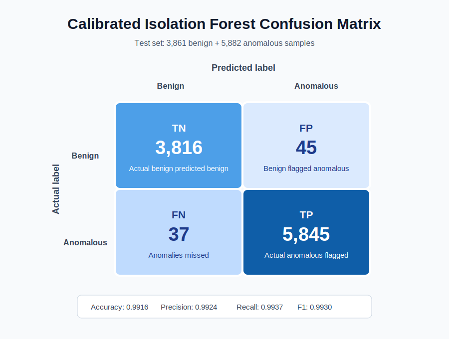
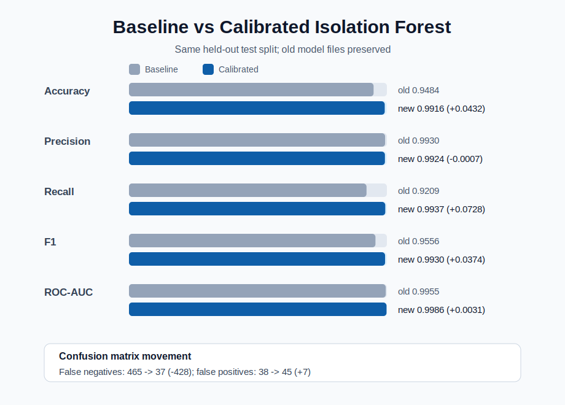

# Calibrated Isolation Forest Model Card

This is a second Isolation Forest experiment. It does not replace or remove the original model.

## What Changed

| Area | Baseline | Calibrated model |
|---|---|---|
| Training data | Benign-only | Benign-only |
| Threshold selection | Fixed 1st percentile from training scores | Selected on validation split after grid search |
| Trees | 200 | 200 |
| `max_samples` | `auto` | `0.7` |
| Threshold | `-0.14801390199248468` | `-0.09681222423838094` |

The change is honest but no longer purely unsupervised thresholding: anomalous validation labels are used to select the operating point. The Isolation Forest fit itself still uses benign samples only. To keep the artifact practical, the script chooses the smallest model within `0.0001` validation F1 of the best grid-search result.

## Split

| Split | Benign | Anomalous | Purpose |
|---|---:|---:|---|
| Train | 11,582 | 0 | Fit Isolation Forest |
| Validation | 3,861 | 5,881 | Select hyperparameters and threshold |
| Test | 3,861 | 5,881 | Final old-vs-new comparison |

Dataset SHA-256: `a4e62ba13435ad3dd583c5790db2175629020fc41c56e1b26baa02a9ae45f03d`

## Same-Test Metrics

| Metric | Baseline | Calibrated | Delta |
|---|---:|---:|---:|
| Accuracy | 0.9484 | 0.9916 | +0.0432 |
| Precision | 0.9930 | 0.9924 | -0.0007 |
| Recall | 0.9209 | 0.9937 | +0.0728 |
| F1 score | 0.9556 | 0.9930 | +0.0374 |
| ROC-AUC | 0.9955 | 0.9986 | +0.0031 |

## Calibrated Confusion Matrix

| Actual \ Predicted | Benign | Anomalous |
|---|---:|---:|
| Benign | 3,816 | 45 |
| Anomalous | 37 | 5,845 |

## Comparison Plot

## Artifact Paths

| Artifact | Path |
|---|---|
| Model | `Code_For_BTA/models/iforest_calibrated.joblib` |
| Evaluation report | `Code_For_BTA/models/iforest_calibrated_eval_report.json` |
| Comparison JSON | `Code_For_BTA/models/iforest_calibrated_comparison.json` |
| Confusion matrix plot | `Code_For_BTA/models/iforest_calibrated_confusion_matrix.svg` |
| Comparison plot | `Code_For_BTA/models/iforest_calibrated_comparison.svg` |

## Readout

The calibrated model is better on this held-out split mainly because it recovers many more anomalies. False negatives drop from 465 to 37, while false positives rise only from 38 to 45. Precision drops slightly, but recall and F1 improve sharply.
