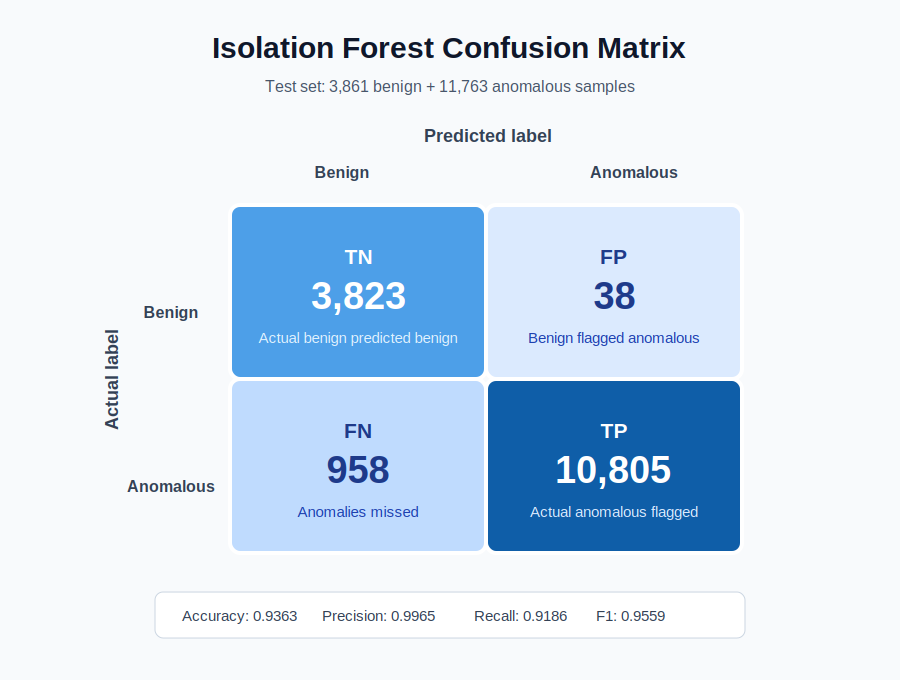

# Isolation Forest Model Card

Generated from:

- Model metadata: `Code_For_BTA/models/iforest.meta.json`
- Evaluation report: `Code_For_BTA/models/eval_report.json`
- Confusion matrix plot: `Code_For_BTA/models/confusion_matrix.svg`

## Data Split

| Split | Class | Samples | Used For |
|---|---:|---:|---|
| Training | Benign | 15,443 | Fits the unsupervised Isolation Forest |
| Test | Benign | 3,861 | Measures false positives / true negatives |
| Test | Anomalous | 11,763 | Measures true positives / false negatives |
| Total dataset | Benign | 19,304 | Source pool before split |
| Total dataset | Anomalous | 11,763 | Source pool before split |

Dataset SHA-256: `a4e62ba13435ad3dd583c5790db2175629020fc41c56e1b26baa02a9ae45f03d`

## Training Setup

| Setting | Value |
|---|---:|
| Model | `sklearn.ensemble.IsolationForest` |
| Training mode | Unsupervised, benign-only |
| Number of features | 10 |
| Number of estimators | 200 |
| Contamination | `auto` |
| Random state | 0 |
| Threshold rule | 1st percentile of benign training decision scores |
| Threshold value | `-0.14801390199248468` |
| Trained at | `2026-05-15T09:46:02.316620+00:00` |

## Feature Set

| # | Feature |
|---:|---|
| 1 | `uri_length` |
| 2 | `query_length` |
| 3 | `num_params` |
| 4 | `max_param_value_length` |
| 5 | `special_char_count` |
| 6 | `digit_ratio` |
| 7 | `non_ascii_count` |
| 8 | `url_depth` |
| 9 | `shannon_entropy` |
| 10 | `method_id` |

## Evaluation Metrics

| Metric | Value |
|---|---:|
| Accuracy | 0.9363 |
| Precision | 0.9965 |
| Recall | 0.9186 |
| F1 score | 0.9559 |
| ROC-AUC | 0.9955 |

## Confusion Matrix

| Actual \ Predicted | Benign | Anomalous |
|---|---:|---:|
| Benign | 3,823 | 38 |
| Anomalous | 958 | 10,805 |

## Readout

The detector is very precise: when it flags a request as anomalous, it is correct about 99.65% of the time on this test set. The main tradeoff is recall: it misses 958 anomalous samples, or about 8.14% of the anomalous test set.
